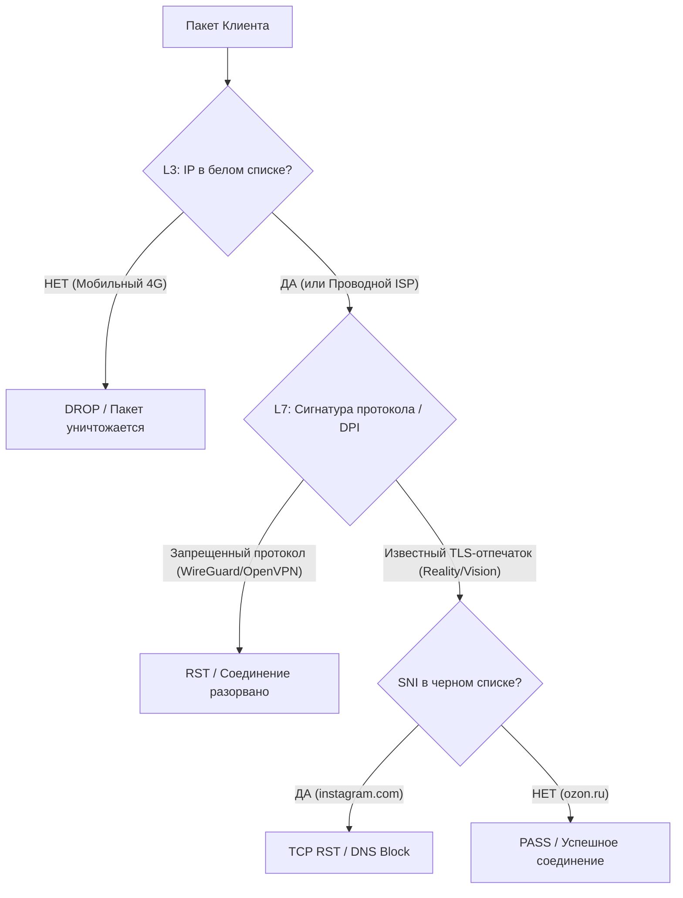

# 🔬 Глубокое исследование: Обход блокировок и обхода белых списков ТСПУ/РКН

> **Дата последнего обновления:** 20 мая 2026 г.  
> **Статус:** Практическая реализация и теоретическая база  
> **Обязательно к изучению:** Всем разработчикам и ИИ-агентам перед модификацией сетевой архитектуры.

---

## 1. Анатомия цензуры в РФ (L3 vs L7 vs DPI)

Для построения эффективной системы обхода блокировок необходимо понимать, на каком уровне сетевой модели OSI происходят ограничения со стороны провайдеров и ТСПУ (Технические средства противодействия угрозам).



### 1.1 L3: Фильтрация по IP (Белые списки)
При активации режима «Белых списков» (WhiteList) на мобильных сетях (особенно выражено на 3G/4G/LTE операторах при введении ЧС или точечном тестировании):
* **Принцип:** Блокируется абсолютно весь исходящий трафик на IP-адреса, не входящие в централизованный перечень разрешенных (около 63 000 IP из ~46 млн российских, что составляет 0.14%).
* **Поведение:** Пакеты до целевого зарубежного сервера уничтожаются на уровне маршрутизации провайдера. ping, ssh и любые порты выдают `Connection timed out`.
* **Специфика:** Полностью блокируется UDP-трафик (за исключением некоторых DNS-серверов).

### 1.2 L7: Сигнатурный DPI и анализ TLS
Если IP-адрес доступен, ТСПУ анализируют структуру пакетов:
* **Блокировка протоколов:** Сигнатуры стандартных VPN (WireGuard, OpenVPN, чистый Shadowsocks) легко распознаются по специфическим заголовкам первого рукопожатия и блокируются в течение нескольких секунд.
* **Блокировка по SNI:** Если внутри TLS Client Hello передается домен из черного списка (например, `instagram.com`, `gemini.google.com`), соединение разрывается отправкой пакета TCP RST.
* **TLS Fingerprinting:** ТСПУ анализируют отпечаток клиента (JA3/JA4). Если клиент заявляет, что он Chrome, но использует нестандартный порядок шифров (свойственный Go-библиотекам Xray без обфускации uTLS), соединение сбрасывается.

---

## 2. Технологии обхода сигнатурных блокировок (DPI)

### 2.1 VLESS + Reality + Vision
Это текущий золотой стандарт обхода DPI для TCP-трафика.
* **VLESS:** Облегченный протокол передачи данных без накладных расходов на шифрование (шифрование полностью делегировано нижележащему TLS-слою).
* **XTLS-Reality:** Устраняет необходимость покупки и регистрации SSL-сертификатов на сервере. Reality «перехватывает» TLS-рукопожатие клиента и пересылает его на легитимный целевой сайт (например, `ozon.ru`). Для DPI сервер выглядит как настоящий веб-сервер маскируемого сайта.
* **Flow `xtls-rprx-vision`:** Специальный режим обфускации длины пакетов TLS. ТСПУ часто определяют VLESS по распределению длин пакетов в начале соединения. Vision добавляет случайный шум (Padding), сглаживая паттерны трафика и делая его неотличимым от обычной загрузки веб-страницы.
* **uTLS Fingerprint:** Подмена TLS-отпечатка. Xray имитирует поведение популярных браузеров (Chrome, Safari, Edge, Firefox), собирая TLS Client Hello в точном соответствии с оригиналом.

### 2.2 Hysteria 2 (UDP-based)
Используется как альтернативный высокоскоростной канал, обходящий ограничения на перегруженных каналах.
* **QUIC/HTTP3:** Протокол работает поверх UDP, что позволяет реализовать агрессивный контроль перегрузок (BBR) и минимизировать задержки.
* **Обфускатор Salamander:** ТСПУ блокируют стандартные заголовки QUIC. Salamander шифрует заголовки пакетов с использованием общего пароля, превращая весь поток данных в высокоэнтропийный случайный шум. Для DPI это выглядит как неопознанный UDP-мусор, который сложнее фильтровать без риска заблокировать коммерческий WebRTC/QUIC трафик.

### 2.3 AmneziaWG (Модифицированный WireGuard)
Использует классический быстрый WireGuard, но защищает его от сигнатурного анализа:
* **Заголовки пакетов:** Байты заголовков пакетов (`Handshake Initiation`, `Response`, `Keepalive`) заменяются на случайные числа, задаваемые параметрами `Jc`, `S1`, `S2`.
* **Мусор в пакетах (Padding):** Параметры `Jmin` и `Jmax` задают размер случайного мусора, который дописывается к пакетам инициализации, предотвращая детекцию по фиксированному размеру пакета (обычно 148 байт).

---

## 3. Глубокий разбор обхода L3-белых списков (WhiteLists)

### 3.1 Почему Cloudflare бесполезен при белых списках
Существует распространенное заблуждение, что блокировку белых списков можно обойти с помощью сервисов Cloudflare (CDN, Workers, Tunnel, WARP). Анализ показывает несостоятельность этой гипотезы:
1. **Cloudflare CDN (VLESS+WS):** Все IP-адреса CDN Cloudflare (подсеть `104.16.0.0/12` и др.) являются зарубежными и не входят в белые списки российских провайдеров. Трафик блокируется на L3.
2. **Cloudflare Workers:** Тот же результат — IP-адреса Workers находятся вне белых списков.
3. **Cloudflare WARP:** Использует протокол WireGuard (UDP). На мобильных сетях UDP полностью блокируется при БС, а IP-адреса WARP (`162.159.192.1`) забанены на L3.
4. **Cloudflare Tunnel:** Не спасает, так как точка подключения тоннеля (`198.41.192.x`) заблокирована.

*Единственный сценарий использования Cloudflare в РФ — маскировка IP основного сервера на домашнем Wi-Fi (где нет БС) для предотвращения прямой блокировки IP-адреса VPS.*

### 3.2 Схема с промежуточным узлом (Relay-Chain)
Для обхода белых списков необходимо построить двухэтапный туннель через сервер, IP-адрес которого физически находится в разрешенном диапазоне ТСПУ (крупные российские ДЦ).

```
 📱 Клиент (Мобильный 4G / Белый список)
     │ 
     │  VLESS + Reality + Vision (Port: 443)
     │  Маскировка SNI: ozon.ru
     ▼
┌────────────────────────────────────────┐
│ 🇷🇺 РФ Relay VPS (Yandex Cloud)         │  <-- IP: 51.250.94.182 (В белом списке ТСПУ)
│ Роль: Xray-релей на входящие сессии     │
└───────────────────┬────────────────────┘
                    │ 
                    │  VLESS + Reality (US IP)
                    ▼
┌────────────────────────────────────────┐
│ 🇺🇸 US Server (Основной VPN)            │  <-- IP: 37.1.212.51
│ Роль: Декапсуляция, Выход в Интернет   │
└───────────────────┬────────────────────┘
                    │
                    ▼
              🌐 Свободный Интернет
```

### 3.3 Хостинг-провайдеры РФ с IP в белых списках (Сравнение)
Для аренды Relay-сервера подходят только провайдеры, чьи подсети массово внесены в списки доверенных:

| Хостинг | IP в БС (кол-во) | Примерная стоимость VPS | Плюсы / Минусы |
|---------|------------------|-------------------------|----------------|
| **Yandex Cloud** | ~12 900 | от 200 руб/мес | 👍 Высокая стабильность IP в БС, есть гранты. 👎 Могут блокировать за аномальный трафик/VPN. |
| **Selectel** | ~1 000 | от 300 руб/мес | 👍 Отличный аптайм, лояльны к сетевым тестам. 👎 Меньше IP-диапазонов. |
| **Timeweb Cloud**| ~2 900 | от 400 руб/мес | 👍 Крупный пул IP, простая аренда. 👎 Высокая стоимость производительных VPS. |
| **Beget** | ~1 600 | от 250 руб/мес | 👍 Дешевые тарифы с посуточной оплатой. 👎 Часто меняются диапазоны. |

### 3.4 Проверенные домены-маскировки (SNI) для Reality
При подключении к РФ-релею необходимо маскировать сессию TLS под сайт, который гарантированно разрешен и работает на данном хостинге (или просто разрешен в РФ):

| Домен | TLS 1.3 | HTTP/2 | Статус в БС | Оценка надежности |
|-------|---------|--------|-------------|-------------------|
| `ozon.ru` | ✅ Да | ✅ Да | ✅ Разрешен | ⭐⭐⭐⭐⭐ Идеально для маскировки |
| `wildberries.ru`| ✅ Да | ✅ Да | ✅ Разрешен | ⭐⭐⭐⭐⭐ Идеально |
| `ads.x5.ru` | ✅ Да | ✅ Да | ✅ Разрешен | ⭐⭐⭐⭐ Хорошо (X5 Group) |
| `auto.ru` | ✅ Да | ✅ Да | ✅ Разрешен | ⭐⭐⭐⭐ Хорошо (Yandex) |
| `2gis.ru` | ✅ Да | ✅ Да | ✅ Разрешен | ⭐⭐⭐⭐ Хорошо |
| `userapi.com` | ✅ Да | ❌ Нет | ✅ Разрешен | ⭐⭐⭐ Средне (нет HTTP/2) |

---

## 4. Нестандартные и перспективные каналы обхода

Если ТСПУ начнет блокировать даже Reality-протоколы на российских IP-адресах, существуют альтернативные варианты скрытой передачи данных.

### 4.1 DoH-туннели (DNS-over-HTTPS)
* **Принцип:** Использование протокола DNS-over-HTTPS для инкапсуляции IP-пакетов.
* **Реализация:** Запросы маскируются под обычные запросы разрешения имен к публичным резолверам (например, `dns.yandex.ru`), которые ТСПУ не могут заблокировать без отключения интернета. Данные передаются внутри DNS-записей типа `TXT` или `CNAME` по протоколу TCP:443.
* **Плюсы:** Работает везде, где разрешен базовый веб-серфинг.
* **Минусы:** Очень высокая задержка (RTT > 300ms) и низкая скорость (до 2-5 Мбит/с).

### 4.2 WebRTC DataChannel (olcRTC)
* **Принцип:** Передача VPN-данных внутри WebRTC-соединений (используемых для видеозвонков и конференций).
* **Реализация:** Проект `olcRTC` маскирует трафик под видеозвонок на популярные российские платформы (Яндекс.Телемост, VK Звонки, SaluteJazz). ТСПУ видит легитимный медиапоток (SRTP/DTLS) к российским серверам.
* **Плюсы:** Высокая пропускная способность (до 10-15 Мбит/с), обходит любые интеллектуальные DPI-детекторы.
* **Минусы:** Сложная настройка клиента и сервера, необходимость держать активную WebRTC сессию.

### 4.3 API-паразитирование (Covert Channels)
* **Принцип:** Передача зашифрованного трафика через API легитимных сервисов.
* **Транспорты:**
  - **VK API (`api.vk.com`):** Запись и чтение сообщений/документов в закрытых группах.
  - **Yandex Disk API (`storage.yandexcloud.net`):** Загрузка и чтение чанков данных через S3-совместимое хранилище (входит в белый список).
  - **Telegram Bot API:** Пересылка Base64-кодированных блоков данных через сообщения боту.
* **Вердикт:** Подходит для экстренного получения текстовой информации, списков подписок или ключей доступа при жестком чебурнете.

---

## 5. Текущая практическая конфигурация проекта

В нашем проекте реализована гибридная отказоустойчивая архитектура.

### 5.1 Маршрутизация на стороне Xray (US Server)
В файле `/etc/xray/config.json` настроена маршрутизация:
1. **Российские ресурсы (Split Routing):** Домены `.ru`, `.рф` и российские IP-подсети направляются напрямую (`outbound: direct`) в обход VPN-туннеля для экономии трафика и сохранения доступа к Госуслугам/банкам.
2. **Зарубежные заблокированные ресурсы:** Соединения перенаправляются на основной выходной узел США.
3. **Обход блокировок Gemini/Google/YouTube:** Трафик к Google-сервисам перенаправляется на встроенный в Xray WireGuard-outbound (WARP), подключенный напрямую к серверам Cloudflare с использованием IPv6/IPv4-туннелирования. Это предотвращает блокировку Google-запросов со стороны хостинга.

### 5.2 Конфигурация RU-релея (`51.250.94.182`)
Релей принимает входящие соединения от клиентов в РФ и пересылает их в США.
Пример конфигурации входящего и исходящего шлюзов релея:
```json
{
  "inbounds": [
    {
      "port": 443,
      "protocol": "vless",
      "settings": {
        "clients": [
          {
            "id": "57ca4aae-dcb3-4fdd-9e14-f9afb42b703c",
            "flow": "xtls-rprx-vision"
          }
        ],
        "decryption": "none"
      },
      "streamSettings": {
        "network": "tcp",
        "security": "reality",
        "realitySettings": {
          "show": false,
          "dest": "ozon.ru:443",
          "xver": 0,
          "serverNames": ["ozon.ru", "www.ozon.ru"],
          "privateKey": "6BsVfWmKPVpqNTMAZL2vW9Q2ROUMCQRhlrUhtlolUXc",
          "shortIds": ["791cd192259bb2b9"]
        }
      }
    }
  ],
  "outbounds": [
    {
      "protocol": "vless",
      "settings": {
        "vnext": [
          {
            "address": "37.1.212.51",
            "port": 443,
            "users": [
              {
                "id": "eb4a1cf2-4235-4b0a-83b2-0e5a298389ed",
                "encryption": "none",
                "flow": "xtls-rprx-vision"
              }
            ]
          }
        ]
      },
      "streamSettings": {
        "network": "tcp",
        "security": "reality",
        "realitySettings": {
          "serverName": "www.microsoft.com",
          "publicKey": "n5E8KcFHjef-ZC2mKjzkVldLJiLrsjfpE1Z-XmLfxH4",
          "shortId": "0123456789abcdef"
        }
      }
    }
  ]
}
```

---

## 6. Практические рекомендации по диагностике блокировок

Если пользователи сообщают о потере связи, администратор должен выполнить диагностику по шагам:

### Шаг 1: Проверка физической доступности IP (TCP SYN)
Поскольку ICMP (ping) на Yandex Cloud заблокирован по умолчанию на уровне сетевой защиты Yandex, проверку проводим через отправку TCP SYN на открытый порт Xray:
```bash
# Проверка из внешней сети (например, локальный ПК или другой сервер)
curl -vI https://51.250.94.182:443 --connect-timeout 5
```
* **Результат `Connection refused`:** Xray на релее упал. Требуется перезапуск службы: `systemctl restart xray`.
* **Результат `Connection timed out`:** IP-адрес релея попал под L3-блокировку ТСПУ. Требуется пересоздать инстанс в Yandex Cloud для получения нового IP.

### Шаг 2: Проверка прохождения TLS Handshake
Если порт открыт, но соединение зависает:
```bash
openssl s_client -connect 51.250.94.182:443 -servername ozon.ru -tls1_3
```
Следите за выводом. Если после отправки `Client Hello` соединение принудительно разрывается (`Connection reset by peer`), значит ТСПУ детектирует TLS-сессию по отпечатку или блокирует SNI `ozon.ru`. Требуется сменить маскирующий SNI на другой из таблицы раздела 3.4.

### Шаг 3: Мониторинг логов сервера назначения
Проверить, доходят ли пакеты от релея до сервера в США:
```bash
# На сервере US (37.1.212.51)
journalctl -u xray -f -n 50 | grep "51.250.94.182"
```
Если пакеты от IP релея фиксируются в логах США, но клиент получает ошибку — проблема на участке между Клиентом и РФ-релеем. Если логов нет — заблокирован канал связи между РФ-релеем и сервером в США (требуется сменить порт на US сервере или обновить ключи Reality).
